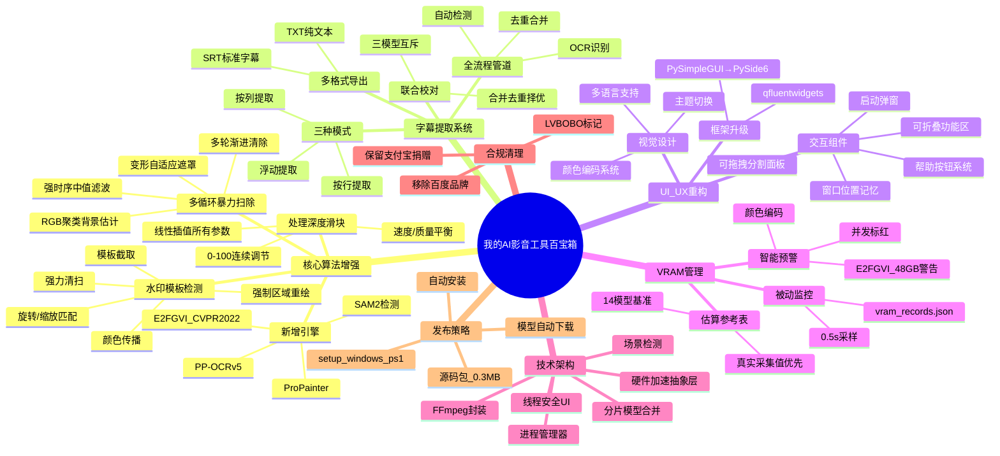

# 我的AI影音工具百宝箱 — 设计思维脑图与开发历程总结

> 本文档记录 我的AI影音工具百宝箱 从 VSR v1.4.0 到当前版本的全部功能演进、设计决策和技术方案。

---

## 一、功能演进脑图



## 二、架构演进历程

### 阶段 1：基础重构（原版→当前）
- **原版**: PySimpleGUI + 基础 STTN + 单任务处理
- **目标**: 现代化 UI + 多算法支持 + 并发处理
- **关键决策**: 选用 PySide6 + qfluentwidgets 而非 Tkinter/PyQt5

### 阶段 2：功能增强
- **处理深度滑块**: 解决用户调参困难，单一控件联动所有模型参数
- **暴力扫除**: 针对AI水印痛点，独创多轮渐进清除算法
- **水印模板**: 从简单OCR扩展为全方位水印检测系统

### 阶段 3：智能管理
- **VRAM系统**: 从"爆显存后崩溃"到"提前预警+采集优化"
- **并发管理**: 自动根据 VRAM 余量限制并发数

### 阶段 4：发布优化
- **初始方案**: 预编译包 3.7GB（含Python环境）
- **问题**: 体积过大不适合 GitHub Release
- **最终方案**: 源码包 0.3MB + 安装脚本自动配置

## 三、关键设计决策

| 决策 | 方案A | 方案B（选中） | 理由 |
|------|-------|-------------|------|
| GUI框架 | PySimpleGUI(原版) | PySide6 + qfluentwidgets | 原生外观 + Fluent Design + 丰富组件 |
| 参数调节 | 分散参数页 | 统一深度滑块 | 降低用户学习成本 |
| 水印算法 | 单次修复 | 多轮暴力扫除 | 针对AI变形水印更有效 |
| 发布包 | 预编译7z(3.7GB) | 源码包(0.3MB)+安装脚本 | 体积缩小100倍+，适合GitHub |
| Python环境 | 捆绑 | 脚本下载 | 减少发布包体积，灵活控制版本 |
| 品牌合规 | 保留所有链接 | 移除百度品牌 | 合规要求 |

## 四、技术难点与解决方案

### 难点 1：变形水印检测
- **问题**: AI水印每帧位置/形状/透明度变化，传统遮罩失效
- **方案**: 密度峰值背景估计 + 变形自适应遮罩 + 强时序滤波
- **效果**: 即使水印完全变形也能准确定位

### 难点 2：爆显存
- **问题**: 用户GPU配置差异大（4GB~48GB），模型显存需求各异
- **方案**: VRAM被动监控 + 颜色编码预警 + 并发数自动标红
- **效果**: 用户在选择配置时即可预知显存风险

### 难点 3：跨线程UI
- **问题**: 工作进程在子进程/线程中运行，直接操作UI崩溃
- **方案**: 信号槽(Signal/Slot)机制 + 回调注册模式
- **效果**: 线程安全的状态更新和进度显示

## 五、数据统计

```
                   原版 v1.4.0    我的AI影音工具百宝箱 v1.4.0
GUI框架            PySimpleGUI    PySide6+qfluentwidgets
修复算法              3种            6种
检测模型              4种            8种
字幕提取              无             支持
水印检测              无             完整支持
VRAM管理              无             完整系统
并发处理              单任务         1-8任务
视频增强             无             SR+waifu2x+RIFE
多语言              无             6种语言
主题切换              无             亮/暗色
帮助系统              无             完整帮助按钮
AI功能导航页          无             3个独立页
GPU实时监控           无             是
显存主动调度           无             是
配置方案管理           无             是
ncnn后端              无             3个(SR/RIFE/waifu2x)
发布包大小           3.7GB          0.3MB(源码)
```

## 六、MCP 服务器使用总结

本次开发过程中，GitHub Copilot 内置的 MCP 工具提供了以下服务：

| MCP工具类别 | 使用场景 |
|------------|---------|
| **文件操作** | 创建/编辑/读取 Python、Markdown、PowerShell 文件 |
| **终端执行** | 运行打包脚本、Git 命令、文件检查 |
| **代码搜索** | grep_search/semantic_search 查找关键代码和品牌名 |
| **Git版本控制** | 提交、推送、分支管理 |
| **浏览器交互** | 无（纯后端开发） |
| **Pylance分析** | Python 语法检查、导入分析 |
| **笔记持久化** | memory 系统记录开发心得 |

## 七、Post-v1.4.0 新增功能（2026-06-20 ~ 2026-06-24）

### 7.1 视频增强系统
- **超分辨率（Real-ESRGAN）**：支持 Python CUDA 和 ncnn-Vulkan 双后端，4 种模型可选
- **waifu2x 动漫超分**：ncnn-Vulkan 后端，cunet/upconv_anime 模型架构，1-10x 缩放
- **帧插值（RIFE）**：Python CUDA 和 ncnn-Vulkan 双后端，2x/3x/4x/8x 插值倍数
- **增强管道**：超分→插帧 或 插帧→超分，任意组合串联

### 7.2 智能显存与调度
- **VRAM 主动调度**：实时监控显存压力，自适应调整批次大小，动态 GC 释放
- **多任务分阶段调度**：字幕/SR/FI 模型分阶段加载，避免显存叠加 OOM
- **锁定专用显存**：防止 Windows WDDM 溢出到共享内存
- **GPU 实时监控弹窗**：nvidia-smi 轮询，进程按 GPU 负载排序

### 7.3 性能优化
- **STTN 字幕处理管线优化**：速度提升 30~50%，显存降低 50%
- **多循环扫除管线优化**：3x→2x 推理次数，导入机制优化
- **GPU 调度改为实际负载驱动**：同时监控显存+核心利用率
- **批次流水线化**：Phase2 后台运行时下一批 Phase1 立即启动

### 7.4 新增页面与组件
- **AI 视频生成页面** (`ai_video_generation_page.py`)
- **AI 音频处理页面** (`audio_ai_page.py`)
- **视频编辑器页面** (`video_editor_page.py`)
- **统一打赏弹窗** (`donation_dialog.py`)
- **启动弹窗** (`startup_dialog.py`)

### 7.5 新增工具模块
- **三个 ncnn 后端**：sr_ncnn_backend, rife_ncnn_backend, waifu2x_ncnn_backend
- **资源管理器** (`resource_manager.py`)：统一模型下载管理
- **配置方案管理** (`config_profile.py`)：多配置保存/切换
- **水印追踪** (`watermark_tracker.py`)：跨帧位置预测
- **模型兼容层** (`model_compat.py`)：版本兼容处理
- **主题监听** (`theme_listener.py`)：系统主题实时切换
- **视频合并** (`merge_video.py`)：多片段合并

## 八、AI 音频工作室（2026-06-24 ~ 2026-06-25）

### 8.1 VoxCPM2 语音引擎集成
- **核心功能**：TTS 语音合成、音色克隆、声音设计、声音转换
- **技术栈**：AudioVAE V2 + LocEnc → TSLM → RALM → LocDiT，48kHz 输出
- **架构**：`VoxCPM2Engine` 封装在 `audio_studio/core/voice_engine.py`
- **线程安全**：`threading.Lock()` 防止并发 CUDA 访问冲突
- **模型加载**：直接本地路径加载，绕过 HF snapshot_download 缓存问题

### 8.2 ACE-Step 1.5 音乐引擎集成
- **核心功能**：文生音乐、歌词生曲、续写、重绘、翻唱、音源分离、LoRA 训练
- **技术栈**：LM 规划器 (CoT) + DiT 扩散，4-step turbo
- **架构**：`AceStepEngine` 封装在 `audio_studio/core/music_engine.py`
- **总模型**：~9.6GB（DiT 4.5GB + LM 3.5GB + VAE 322MB + TextEnc 1.1GB）

### 8.3 Gradio WebUI
- **统一入口**：`webui/app.py` 包含语音/音乐/工具/路径设置四个 Tab
- **独立启动**：`launch_voxcpm.py` / `launch_ace.py` 支持单独运行
- **端口自动检测**：冲突时自动递增到可用端口
- **路径配置**：`user_config.json` 持久化用户自定义路径

### 8.4 架构决策
- **vendor 目录重构**：按 AI 领域 `ai_audio/` / `ai_video/` / `ai_video_edit/` 划分
- **路径内化**：所有外部路径迁移至 `vendor/ai_audio/`，`HF_HOME` 指向共享模型缓存
- **镜像支持**：`download_models.py` 支持 HF 镜像(hf-mirror.com)和 ModelScope
- **集成测试**：41/41 测试通过，覆盖导入、实例化、UI 创建、模型权重、路径完整性

### 8.5 解决问题记录
| 问题 | 根因 | 解决方案 |
|------|------|---------|
| Gradio 6.x 移除 prevent_thread_from_blocking | API 变更 | 移除该参数 |
| torchaudio DLL 加载失败 | 用户 site-packages 冲突 | PYTHONNOUSERSITE=1 |
| VoxCPM2 不存在 resolve_runtime_device | API 名称错误 | 修改为正确 API |
| ACE-Step Gradio 6 滑块异常 | min=max=0 配置问题 | 修复默认值 |
| SSL 证书验证失败 | QPT Python 捆绑问题 | verify=False, local_files_only=True |
| 并发生成 CUDA invalid argument | 同时访问 GPU | threading.Lock 序列化 |
| VRAM 泄漏 | @cached_property 不释放 | 改为 @property + unload_inpaint_models() |

## 九、GPU 检测式让步（2026-06-25）

### 9.1 背景
字幕去除过程中 ProPainter/STTN 持续饱和 GPU 计算资源（VRAM 不到 50% 但 GPU 3D 100%），导致 Windows DWM 线程饥饿，桌面严重卡顿。

### 9.2 方案演进
1. ❌ 硬性 sleep(1) — 用户要求「不要做硬性修改」
2. ✅ 检测式让步 — 用 `torch.cuda.synchronize()` 耗时估算 GPU 繁忙度

### 9.3 最终实现
- `_gpu_yield_enabled` 全局标记，**仅模型加载处理中**为 True
- `_gpu_yield_if_busy()` 利用 `torch.cuda.synchronize()` 耗时判断
- 空闲 > 5s → 间隔 10s，繁忙 > 10ms → 间隔 0.5s + 让步 1ms
- 处理完成 → `_gpu_yield_enabled = False` + `unload_inpaint_models()` + `gc.collect()` + `torch.cuda.empty_cache()`

---

## 十、相关文档索引

| 文档 | 说明 |
|------|------|
| `README.md` | 项目主页（中文） |
| `README_en.md` | 项目主页（英文） |
| `docs/ARCHITECTURE.md` | 技术架构详情 |
| `docs/FEATURES.md` | 功能设计详情 |
| `docs/CHANGELOG.md` | 版本变更日志 |
| `.claude/skills/vsr-dev-history.md` | 开发历程Skill（可复用） |
| `.claude/skills/multi-sweep-watermark-removal.md` | 暴力扫除算法Skill |
| `scripts/README.md` | 发布工具说明 |

---

*本文档最后更新: 2026-06-26*
